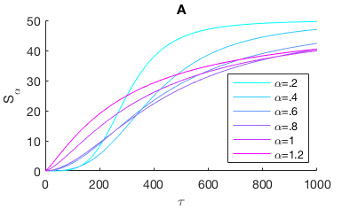
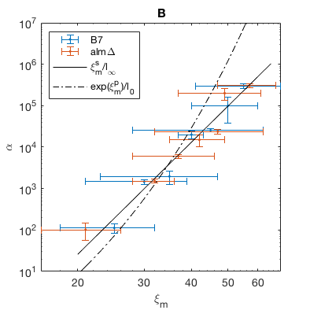

Figure 2: ??? controls
???
of ???
in the ??? system.
In panel A, we show the response of ???
, in units of ???
/???,
as ??? increases.
Several values of ??? are shown.
Using ???
allows us to infer ???
from observations of ???
in ???.
In panel B, we compare the resulting estimations of ???
in units of ???.
Data are shown for two conditions, ??? and ???.
Overlaid curves are best fits of the ??? model
and the ??? model.
